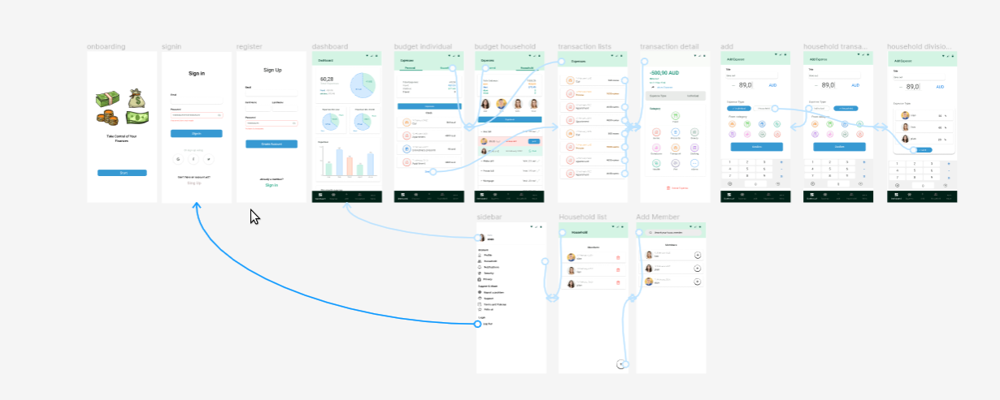
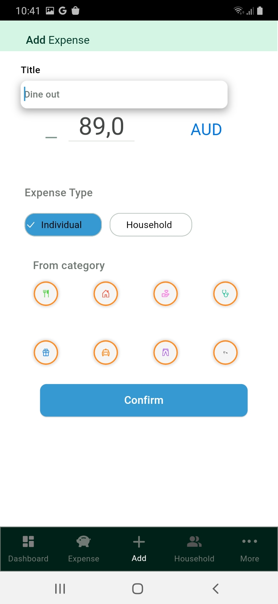

# Household Expense App

A Flutter application to manage household expenses.

## Features

- Track and categorize household expenses.
- View monthly expense reports.
- Set budget limits for different expense categories.
- User-friendly interface for easy expense entry.

## Figma Screenshots




## Mobile App Screenshots

<div style="display: flex; flex-wrap: wrap; gap: 16px;">
  
  
  
  
  
  
  
  
  
  
  
  
</div>


## Getting Started

Follow these instructions to get a copy of the project up and running on your local machine for development and testing purposes.

### Prerequisites

- Flutter installed on your machine. [Install Flutter](https://flutter.dev/docs/get-started/install)

### System requirements

Dart SDK Version 2.18.0 or greater.
Flutter SDK Version 3.3.0 or greater.


### Application structure
After successful build, your application structure should look like this:
                    
```
.
├── android                         - It contains files required to run the application on an Android platform.
├── assets                          - It contains all images and fonts of your application.
├── ios                             - It contains files required to run the application on an iOS platform.
├── lib                             - Most important folder in the application, used to write most of the Dart code..
    ├── main.dart                   - Starting point of the application
    ├── core
    │   ├── app_export.dart         - It contains commonly used file imports
    │   ├── constants               - It contains static constant class file
    │   └── utils                   - It contains common files and utilities of the application
    ├── presentation                - It contains widgets of the screens
    ├── routes                      - It contains all the routes of the application
    └── theme                       - It contains app theme and decoration classes
    └── widgets                     - It contains all custom widget classes
```

### Installing

1. Clone the repository:

   ```bash
   git clone https://github.com/your-username/household_expense_app.git

2. Navigate to the project directory:

   ```bash
   cd koiux

3. Install dependencies:

   ```bash
   flutter pub get

4. Run the app:

   ```bash
   flutter run


### License

#### !! Free for all, Feel free to visit again !!
